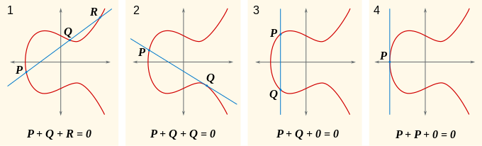

# Windows XP Confirmation IDs

By WitherOrNot

# Background

In the interest of convenience for those who would like to do further research into or implementation of the Confirmation ID system, a summary of the mathematics involved in hyperelliptic curve cryptography is provided below.

If you are not interested in the mathematics, please skip to [Validation Mechanism](#Validation-Mechanism).

## Hyperelliptic Curves

An imaginary hyperelliptic curve $E$ of genus $g$ is a set of points $(x,y)$ that satisfies the following relation:

$$ y^2 + y \cdot h(x) \equiv F(x) \pmod {p} $$

where $F(x)$ is a monic polynomial of degree $2g+1$, $h(x)$ is a polynomial of degree less than $g+2$, and $p$ is a prime number.

For this write-up, we will be focusing on the curves used by the Confirmation ID system which are genus 2 curves where $h(x) = 0$, thus

$$ y^2 \equiv x^5 + a_{4}x^4 + a_{3}x^3 + a_{2}x^2 + a_{1}x + a_0 \pmod {p} $$

Those familiar with the related concept of elliptic curves may assume points on this curve follow a similar group law. However, the group law for hyperelliptic curves is very different.

As a refresher, for points on elliptic curves, a form of addition can be done by defining the sum of 2 points to be the reflection of their third collinear point over the y-axis.



This works because any line on the projective plane (a plane with a defined point at infinity) that passes through 2 points on this curve will intersect exactly at one other point, even if the two points are identical (we define the point at infinity to be on the curve).

As an exercise for the reader, see how the same property fails to hold on the following hyperelliptic curve.


Therefore, a different group representation will be needed for hyperelliptic curves.

## Divisors

We define the divisor $D$ over the curve $E$ to be a formal linear combination of all $n$ points $P_i$ on the curve with weights $c_i$.

$$ D = \sum_{i=1}^{n} c_{i}P_{i} $$

"Formal" means that there is no actual definition of summation or scalar multiplication on points, it simply denotes the behavior we want divisors to have.

The only operation that is defined on individual points is negation, which for a point $P = (x,y)$ is defined as $-P = (x,-y)$. 

Divisors, however, can be added and multiplied by scalars according to their definition. This allows the construction of a group, but this group is too large to be cryptographically useful. Therefore, we will need to consider a subset of divisors with useful properties.

## Semi-reduced and reduced divisors

Semi-reduced divisors are divisors where for all $P_i$ with non-zero coefficients $c_i$, there are no two $P_a$ and $P_b$ such that $P_a = -P_b$. Thus, the divisors sum only across sets of points where no two points are negatives of each other.

Reduced divisors are semi-reduced divisors where the sum of all coefficients in $D$ is less than or equal to $g$. Additionally, when added, reduced divisors undergo an additional step known as reduction.

The reduction algorithm is as follows:
1. Let $v(x)$ be a polynomial such that for all $P_i=(x_i,y_i)$ in $D$, $y_i=v(x_i)$
2. Find all points $Q_i=(x_i,y_i)$ on the curve such that $q(x)=F(x)-v(x)^2=0$ for all $x_i$.
 - If the coefficient $c_i$ of $P_i$ is greater than 1 in $D$, $q$ must have a root of multiplicity $c_i$ at $x_i$.
 
 
3. From the set of points $Q_i$, remove all points $P_i$.
4. Let $E=-\sum Q_i$.
5. If the number of points in $E$ is less than or equal to $g$, then stop, the reduction of $D$ is $E$. Otherwise, let $D=E$ and repeat from step 1.

Reduction by this method is analogous to the modulo operation for integers, in that it maps the group of all divisors to a cyclic group known as the *Jacobian* $J(E)$.

Some useful observations can be made about the reduction procedure. Notice first that it is necessary for the polynomial $q$ to equal 0 for all $x_i$ of the points $P_i$ in the divisor $D$, as can be seen from the curve equation and the definition of $v$. Therefore, we can let $q(x)=u(x)q'(x)$, where the polynomial $u(x)=0$ has roots $x_i$ with multiplicity $c_i$ for all the points $P_i$ in $D$. 

Next, it can be seen that after step 3, the x-coordinates $x_i$ of the remaining points $Q_i$ are exactly the roots of $q'(x)$.

Note that in many cases, $q'(x)$ will be an irreducible (non-factorable) polynomial, so the points $Q_i$ will contain coordinates that are not integers, which makes representing reduced divisors difficult. Luckily, using the above observations, a simpler representation of semi-reduced and reduced divisors can be constructed.

## Mumford representation

The Mumford representation of a semi-reduced divisor $D=\sum c_i(x_i,y_i)$ is the pair of polynomials $u(x)$ and $v(x)$:

$$ u(x) = \prod_{i=1}^{n} (x-x_i)^{c_i} $$

$$ v^2 \equiv F \pmod {u} $$

With this, the divisor can now be re-defined as $D=\langle u(x), v(x) \rangle$.

From the previous observations, it can be seen that $u$ and $v$ in this representation exactly the polynomials $u$ and $v$ from the reduction steps above. Therefore, the reduction algorithm is much more concise using the Mumford representation.

Reduction algorithm for $D=\langle u,v \rangle$:
1. Let $u' = \frac{F-v^2}{u}$
2. Let $v' = -u \bmod p$
3. If $deg(u') \leq g$, then stop. $E = \left\langle u', v' \right\rangle$ is the reduction of $D$. Otherwise, let $u=u'$ and $v=v'$ and start from step 1.

With the Mumford representation and reduction defined, we are ready to state the central problem of hyperelliptic curve cryptography.

## Cryptographic problem

Let the scalar multiplication of a divisor $D$ by the integer $r$ be defined as follows:

$$ \left[r\right]D = \overbrace{D+\ldots+D}^{r \text{ times}} $$

Then the cryptographic problem for hyperelliptic curve cryptography is to find an integer $k$ such that

$$ D = \left[k\right] D_2 $$

given that

$$ D_2 = \left[e\right] D $$

for some known integer $e$ and a pair of known divisors $D$ and $D_2$.

To compute $k$ from $e$, we need to know the *order* of the Jacobian $N=\\#J(E)$, which is the number of unique divisors in $J$.

When this value is known, $k$ can be computed in a straightforward manner:

$$ k = e^{-1} \pmod {N} $$

Computation of $k$ and $\\#J(E)$ is a difficult process, discussed in [Parameter Extraction](#Parameter-Extraction). For now, we will go into the mechanism behind confirmation ID generation and validation.

# Validation Mechanism

The confirmation ID is derived directly from a value known as the *Installation ID*. This value is displayed to the user when selecting the "Telephone Activation" option when activating a product, as shown below.


As seen in the screenshot, the confirmation ID is broken into 6-digit groups. This is related to the first validation step, known as the checksum.

## Checksum

Within each 6-digit group $d_1d_2d_3d_4d_5d_6$, the checksum digit $d_6$ is calculated from the others as $d_6 = (d_1 + 2d_2 + d_3 + 2d_4 + d_5) \bmod {7}$.

For instance, from the screenshot above, the checksum digit for the group $154814$ is $4$, and $(1 + 2\cdot5 + 4 + 2\cdot8 + 1) \bmod {7} = 32 \bmod 7 = 4$.

Once the checksums are validated for each digit group, the checksum digits are removed and the remaining digits are concatenated to form an integer that we will refer to as $C$.

## Hyperelliptic Decryption

C is then split into two integers $x_1$ and $x_2$ like so:

$$ x_1 = \left \lfloor {\frac{C}{p+1}} \right \rfloor $$

$$ x_2 = C \bmod {(p+1)} $$

with $p$ being the modulus for the hyperelliptic curve used to validate the confirmation ID.

Next, the divisor $D$ is constructed as follows:

$\text{Let } m \text{ be the smallest integer such that } c^2 \not\equiv m \pmod {p} \text{ for all integers } c$

$\text{If } x_1 \leq p \text{:}$

$\quad\text{Determine } y_1 \text{ such that } (x_1, y_1) \text{ is on the curve} $

$\quad\text{Determine } y_2 \text{ such that } (x_2, y_2) \text{ is on the curve} $

$\quad\text{If } x_2 \lt x_1 \text{ and } y_1 \equiv y_2 \pmod {2} \text{  or } x_2 \geq x_1 \text{ and } y_1 \not\equiv y_2 \pmod {2} \text{:}$

$\quad\quad y_2 = p - y_2 $

$\quad \text{Let } D = (x_1, y_1) + (x_2, y_2) \text{ stored as Mumford representation}$

$\text{Else:}$

$\quad \text{Let } s(x)=(x+x_2)^2 - mx_1^2 $

$\quad\text{Find a root } w \text{ of } s$

$\quad\text{Determine } z \text{ such that } (w,z) \text{ is on the curve }$

$\quad\text{Let } D = (w,z) + (w^p, z^p) \text{ stored as Mumford representation}$

Next, the divisor $D_2$ is calculated as $D_2 = \left[65537\right]D$.

Expressing $D_2$ as $\left\langle x^2 + u_1x + u_0, v_1x + v_0 \right\rangle$, we compute the values $t_1$ and $t_2$ as follows:

$$ t_1 = \frac{u_1}{2} $$

$$ t_2 = \sqrt{\frac{t_1^2 - u_0}{m}} $$

And finally, we compute the value $D_E = t_1 + p(t_2 - 1)$.

## Feistel Cipher

`Note: the following information applies to MS Plus! DME, Office XP, and Windows. Office 03 and 07 use a much more complex encoding scheme that has not been fully reverse engineered as of writing.`

The last step is to decrypt the data in $D_E$ using a key derived from the installation ID.

The installation ID is first validated and has its checksum digits removed to form an integer, just like with the confirmation ID. Then, it is converted to a little endian byte representation and decrypted using a 4-byte key.

The decryption algorithm uses a variant of a Feistel cipher. Its pseudocode is provided below:

```
function decrypt_feistel(data, key):
    size_half := data.length / 2
    size_half_dwords := size_half - (size_half % 4) // Round size_half down to multiple of 4
    last_byte := data[2 * size_half:] // For odd lengths of data, this contains the last byte, otherwise empty
    data = data.slice[:2 * size_half]
    
    repeat 4 times:
        first_half := data[:size_half]
        second_half := data[size_half:]
        hash := SHA1(first_half + key)
        hash = hash[:size_half_dwords] + hash[4 + size_half_dwords - (size_half % 4):4 + size_half_dwords]
        data = (second_half ^ hash) + first
    
    return data + last_byte
```

The decrypted IID data is either 17 or 19 bytes, with the following structure:

```
struct DecryptedIID {
    byte hwid[8];
    // The following values correspond to the product code
    // rpc-chid-seq-last
    uint last : 17 bits;
    uint version : 3 bits; // 4 for XP RTM, 5 for XP SP1+
    uint seq : 24 bits;
    uint chid : 10 bits;
    uint rpc : 9 bits;
    ushort key_hash; // Only in SP1+, contains 12 bits of product key hash
}
```

The IID data is then rearranged into a 16-byte key like so:

```
key = hwid + bytes_from_int((chid << 58 | rpc << 41 | seq << 17 | last) & BITMASK(64))
```

Finally, the value $D_E$ from the previous section is converted to little endian and decrypted with this key using the Feistel cipher.

The structure of the decrypted CID data is as follows:

```
struct DecryptedCID {
    byte key_hash[6]; // Genuine CIDs have bytes of the product key hash stored here, but they're usually not checked
    bool check_hash; // key_hash is checked only if this byte is true
    byte attempt; // When generating CIDs, this byte is incremented for each generation attempt, maximum of 0x80 times
    byte zero[6]; // Must be zeroes
}
```

# Parameter Extraction

Other software that is known to use this confirmation ID system includes Microsoft Plus! Digital Media Edition and Microsoft Office XP through 2007. The parameters for these products have already been extracted, but the extraction procedure will be documented here for completeness.

The parameters for confirmation ID generation are stored in `licdll.dll` (Windows), `MSO.DLL` (Office), or `MPA.DLL` (MS Plus). These DLLs are obfuscated, and therefore will need to be deobfuscated using AntiWPA Generic by the AntiWPA Team.

1. Download [AntiWPA Generic 2.3](https://antiwpa.planet-dl.org/Generic%20Antiwpa-2.3-WinXP-2k3.ZiP). Username and password are `planet-dl.org`.
2. Extract the DLL.
3. Under the Options menu, uncheck "Apply OOBE Fix" and "Apply WPA Fix". 
4. Check "Remove selfcheck blocks" and "Remove crypt blocks". The menu that comes up after "Remove selfcheck blocks" is not important, any option can be picked.
5. Ensure that "Save decrypted code to .exe" is checked.
6. Open the DLL and click "Apply / Browse"
7. Open the decrypted DLL file in a disassembler, and search for the byte pattern "01 00 01 00" or the integer 0x10001.
8. Find an instruction fitting the pattern `mov dword ptr [esi/ebp + ??h], 10001h`.
9. Decompile the surrounding function.

An example when run on Windows XP SP3's `licdll.dll` with IDA is provided below.

```
int __stdcall sub_6107FAF4(int a1)
{
  int v1; // edi
  _DWORD *v2; // eax

  v1 = 0;
  *(_DWORD *)a1 = 2;
  *(_DWORD *)(a1 + 4) = 2;
  *(_DWORD *)(a1 + 8) = 4;
  if ( !sub_610A064B(a1) )
    return 14;
  v2 = *(_DWORD **)(a1 + 24);
  *(_DWORD *)(a1 + 12) = 65537;
  *v2 = 0x6D7F2A79;
  *(_DWORD *)(*(_DWORD *)(a1 + 24) + 4) = 0x16A6B03;
  **(_DWORD **)(a1 + 28) = 0;
  *(_DWORD *)(*(_DWORD *)(a1 + 28) + 4) = 0;
  *(_DWORD *)(*(_DWORD *)(a1 + 28) + 8) = 0x36C85381;
  *(_DWORD *)(*(_DWORD *)(a1 + 28) + 12) = 0x218401;
  *(_DWORD *)(*(_DWORD *)(a1 + 28) + 16) = 0x83892AD0;
  *(_DWORD *)(*(_DWORD *)(a1 + 28) + 20) = 0x44197B;
  *(_DWORD *)(*(_DWORD *)(a1 + 28) + 24) = 0x322B3B04;
  *(_DWORD *)(*(_DWORD *)(a1 + 28) + 28) = 0x1400606;
  *(_DWORD *)(*(_DWORD *)(a1 + 28) + 32) = 0x322B3B04;
  *(_DWORD *)(*(_DWORD *)(a1 + 28) + 36) = 0x1400606;
  *(_DWORD *)(*(_DWORD *)(a1 + 28) + 40) = 1;
  *(_DWORD *)(*(_DWORD *)(a1 + 28) + 44) = 0;
  return v1;
}
```

The variable `a1` is a pointer to a `WPAHyperellipticParams` struct with the following layout:

```
// BigInts are stored as 2 DWORDs in little endian order
struct BigInt {
    uint low;
    uint high;
}

struct WPAHyperellipticParams {
    uint genus; // Genus of the curve, almost always 2
    uint modulus_size; // Size of prime modulus in DWORDs, almost always 2
    uint unknown;
    uint public_multiplier; // Value multiplied by initial divisor to verify CID
    uint modulus[modulus_size]; // Prime modulus of curve
    BigInt coefficients[6]; // Coefficients of F(x) in order of lowest to highest degree
}
```

Then, download the private key solver from [here](https://github.com/UMSKT/XPCIDSolver). Edit solve.py to include the parameters from the DLL, run `Install.sh`, then run `solve.py`. The solver will then output the private key for the curve, which can then be used to generate confirmation IDs.
